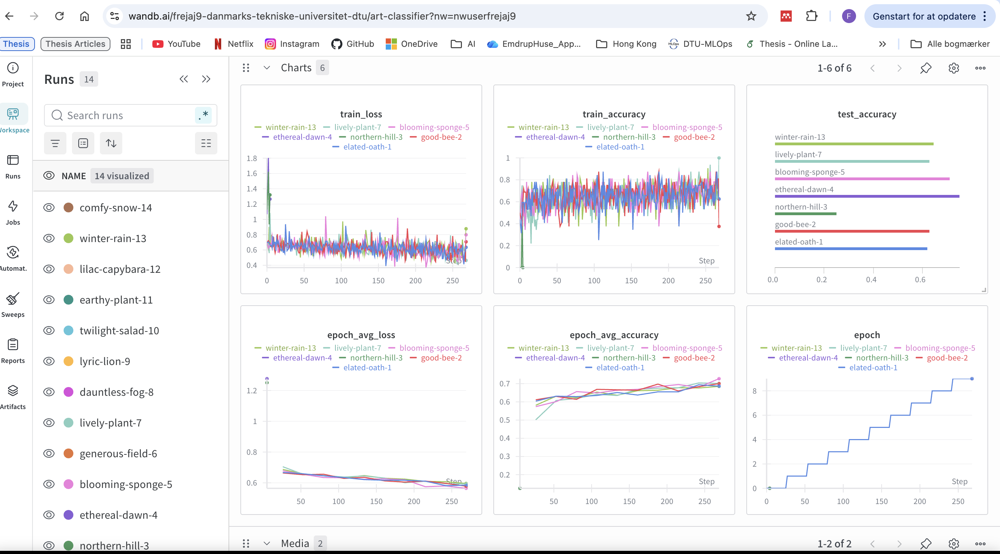
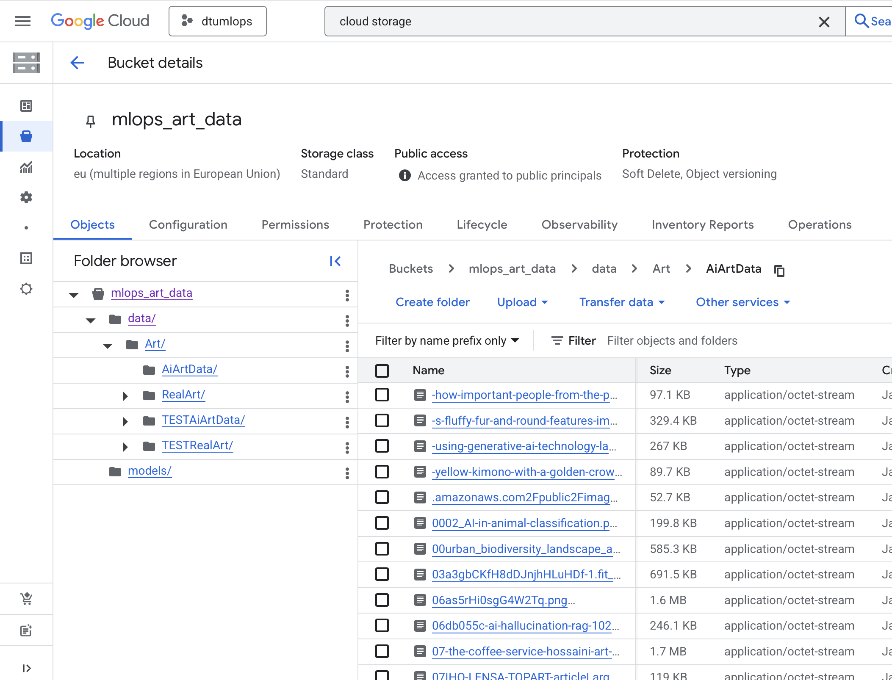
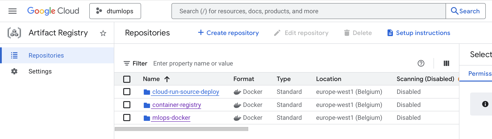
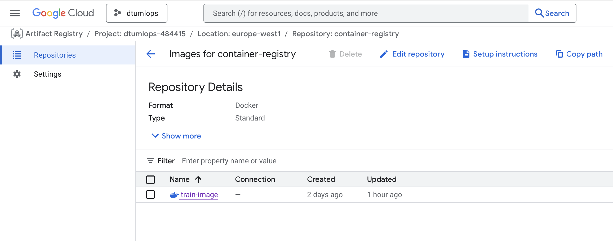
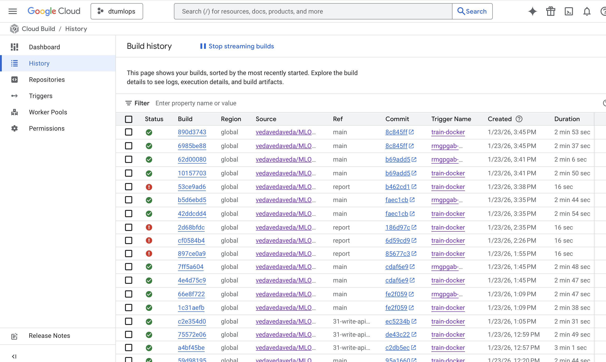
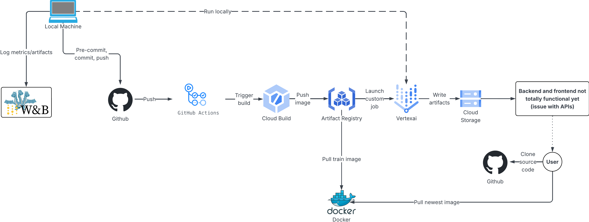

# Exam template for 02476 Machine Learning Operations

This is the report template for the exam. Please only remove the text formatted as with three dashes in front and behind
like:

```--- question 1 fill here ---```

Where you instead should add your answers. Any other changes may have unwanted consequences when your report is
auto-generated at the end of the course. For questions where you are asked to include images, start by adding the image
to the `figures` subfolder (please only use `.png`, `.jpg` or `.jpeg`) and then add the following code in your answer:

``

In addition to this markdown file, we also provide the `report.py` script that provides two utility functions:

Running:

```bash
python report.py html
```

Will generate a `.html` page of your report. After the deadline for answering this template, we will auto-scrape
everything in this `reports` folder and then use this utility to generate a `.html` page that will be your serve
as your final hand-in.

Running

```bash
python report.py check
```

Will check your answers in this template against the constraints listed for each question e.g. is your answer too
short, too long, or have you included an image when asked. For both functions to work you mustn't rename anything.
The script has two dependencies that can be installed with

```bash
pip install typer markdown
```

or

```bash
uv add typer markdown
```

## Overall project checklist

The checklist is *exhaustive* which means that it includes everything that you could do on the project included in the
curriculum in this course. Therefore, we do not expect at all that you have checked all boxes at the end of the project.
The parenthesis at the end indicates what module the bullet point is related to. Please be honest in your answers, we
will check the repositories and the code to verify your answers.

### Week 1

* [x] Create a git repository (M5)
* [x] Make sure that all team members have write access to the GitHub repository (M5)
* [x] Create a dedicated environment for you project to keep track of your packages (M2)
* [x] Create the initial file structure using cookiecutter with an appropriate template (M6)
* [x] Fill out the `data.py` file such that it downloads whatever data you need and preprocesses it (if necessary) (M6)
* [x] Add a model to `model.py` and a training procedure to `train.py` and get that running (M6)
* [x] Remember to fill out the `requirements.txt` and `requirements_dev.txt` file with whatever dependencies that you are using (M2+M6)
* [x] Remember to comply with good coding practices (`pep8`) while doing the project (M7)
* [ ] Do a bit of code typing and remember to document essential parts of your code (M7)
* [x] Setup version control for your data or part of your data (M8)
* [ ] Add command line interfaces and project commands to your code where it makes sense (M9)
* [x] Construct one or multiple docker files for your code (M10)
* [x] Build the docker files locally and make sure they work as intended (M10)
* [x] Write one or multiple configurations files for your experiments (M11)
* [x] Used Hydra to load the configurations and manage your hyperparameters (M11)
* [x] Use profiling to optimize your code (M12)
* [x] Use logging to log important events in your code (M14)
* [x] Use Weights & Biases to log training progress and other important metrics/artifacts in your code (M14)
* [x] Consider running a hyperparameter optimization sweep (M14)
* [ ] Use PyTorch-lightning (if applicable) to reduce the amount of boilerplate in your code (M15)

### Week 2

* [x] Write unit tests related to the data part of your code (M16)
* [x] Write unit tests related to model construction and or model training (M16)
* [ ] Calculate the code coverage (M16)
* [x] Get some continuous integration running on the GitHub repository (M17)
* [x] Add caching and multi-os/python/pytorch testing to your continuous integration (M17)
* [ ] Add a linting step to your continuous integration (M17)
* [x] Add pre-commit hooks to your version control setup (M18)
* [x] Add a continues workflow that triggers when data changes (M19)
* [ ] Add a continues workflow that triggers when changes to the model registry is made (M19)
* [x] Create a data storage in GCP Bucket for your data and link this with your data version control setup (M21)
* [x] Create a trigger workflow for automatically building your docker images (M21)
* [x] Get your model training in GCP using either the Engine or Vertex AI (M21)
* [x] Create a FastAPI application that can do inference using your model (M22)
* [x] Deploy your model in GCP using either Functions or Run as the backend (M23)
* [x] Write API tests for your application and setup continues integration for these (M24)
* [x] Load test your application (M24)
* [ ] Create a more specialized ML-deployment API using either ONNX or BentoML, or both (M25)
* [x] Create a frontend for your API (M26)

### Week 3

* [ ] Check how robust your model is towards data drifting (M27)
* [ ] Deploy to the cloud a drift detection API (M27)
* [ ] Instrument your API with a couple of system metrics (M28)
* [ ] Setup cloud monitoring of your instrumented application (M28)
* [x] Create one or more alert systems in GCP to alert you if your app is not behaving correctly (M28)
* [x] If applicable, optimize the performance of your data loading using distributed data loading (M29)
* [ ] If applicable, optimize the performance of your training pipeline by using distributed training (M30)
* [ ] Play around with quantization, compilation and pruning for you trained models to increase inference speed (M31)

### Extra

* [x] Write some documentation for your application (M32)
* [ ] Publish the documentation to GitHub Pages (M32)
* [x] Revisit your initial project description. Did the project turn out as you wanted?
* [x] Create an architectural diagram over your MLOps pipeline
* [x] Make sure all group members have an understanding about all parts of the project
* [x] Uploaded all your code to GitHub

## Group information

### Question 1
> **Enter the group number you signed up on <learn.inside.dtu.dk>**
>
> Answer:

39

### Question 2
> **Enter the study number for each member in the group**
>
> Example:
>
> *sXXXXXX, sXXXXXX, sXXXXXX*
>
> Answer:

s195473, s233910, s233912

### Question 3
> **A requirement to the project is that you include a third-party package not covered in the course. What framework**
> **did you choose to work with and did it help you complete the project?**
>
> Recommended answer length: 100-200 words.
>
> Example:
> *We used the third-party framework ... in our project. We used functionality ... and functionality ... from the*
> *package to do ... and ... in our project*.
>
> Answer:

No we did not use any other packages then the ones that was explained in the course.

## Coding environment

> In the following section we are interested in learning more about you local development environment. This includes
> how you managed dependencies, the structure of your code and how you managed code quality.

### Question 4

> **Explain how you managed dependencies in your project? Explain the process a new team member would have to go**
> **through to get an exact copy of your environment.**
>
> Recommended answer length: 100-200 words
>
> Example:
> *We used ... for managing our dependencies. The list of dependencies was auto-generated using ... . To get a*
> *complete copy of our development environment, one would have to run the following commands*
>
> Answer:

We managed dependencies using uv, a fast Python package manager. All project dependencies
are defined in `pyproject.toml`, with production dependencies listed under `dependencies`
and development tools (testing, linting, documentation) in the `dev` dependency group.
We configured custom package indexes for PyTorch CPU-only builds to reduce installation size.

For a new team member to get an exact copy of our environment, they would:

1. Install uv depending on you OS and preference:
   - macOS/Linux: `curl -LsSf https://astral.sh/uv/install.sh | sh`
   - macOS (Homebrew): `brew install uv`
   - Windows: `powershell -c "irm https://astral.sh/uv/install.ps1 | iex"`
   - Any OS: `pip install uv`
2. Clone the repository
3. Run `uv sync` in the project root

The `uv.lock` file ensures the exact same builds for anyone by pinning all dependencies to specific versions. This guarantees that every team member works with identical package versions, eliminating "works on my machine" issues. The lock file is automatically generated when dependencies change and should be committed to version control.

### Question 5

> **We expect that you initialized your project using the cookiecutter template. Explain the overall structure of your**
> **code. What did you fill out? Did you deviate from the template in some way?**
>
> Recommended answer length: 100-200 words
>
> Example:
> *From the cookiecutter template we have filled out the ... , ... and ... folder. We have removed the ... folder*
> *because we did not use any ... in our project. We have added an ... folder that contains ... for running our*
> *experiments.*
>
> Answer:

We initialized our project using the cookiecutter MLOps template, which provided a good foundation for the
kind of project we are doing. We filled out the standard directories: `src/ml_ops_project/` with our
core modules, `tests/` for unit testing, `configs/` for Hydra configuration files, `data/`
for datasets, and `dockerfiles/` for Docker containers.

Our main deviations and additions include:

- `analyze/`: Custom directory for data analysis and exploration
- `.dvc/` and `data.dvc`: Integrated DVC for data version control and tracking large datasets
- Multiple Dockerfiles: Separated `backend.dockerfile`, `frontend.dockerfile`, and additional files
  in `dockerfiles/` for different services (training, API, frontend)
- `cloudbuild.yaml`: Google Cloud Build configuration for automated deployment
- Split requirements files: Created separate requirements for backend, frontend, and development environments

These additions enhanced our MLOps workflow with better data versioning and cloud deployment capabilities.

### Question 6

> **Did you implement any rules for code quality and format? What about typing and documentation? Additionally,**
> **explain with your own words why these concepts matters in larger projects.**
>
> Recommended answer length: 100-200 words.
>
> Example:
> *We used ... for linting and ... for formatting. We also used ... for typing and ... for documentation. These*
> *concepts are important in larger projects because ... . For example, typing ...*
>
> Answer:

We implemented several code quality measures. Pre-commit hook* automatically enforce standards before
each commit, including trailing whitespace removal, end-of-file fixing, YAML validation, and blocking
large files. Before committing, we check our code against these rules with `uv run pre-commit run --all-files`.

We also made sure to write comments throughout our code to help team members quickly understand its purpose.

These practices are essential in larger projects. Automated checks prevent inconsistencies and eliminate
debates about code style, allowing developers to focus on logic rather than formatting. Documentation
and clear comments reduce onboarding time for new team members and make the codebase easier to maintain.
Without these standards, code quality becomes worse over time as different developers introduce their own
styles, making collaboration difficult. These practices create a foundation for teams to work efficiently
while maintaining code quality and preventing technical debt of getting too bad.

## Version control

> In the following section we are interested in how version control was used in your project during development to
> corporate and increase the quality of your code.

### Question 7

> **How many tests did you implement and what are they testing in your code?**
>
> Recommended answer length: 50-100 words.
>
> Example:
> *In total we have implemented X tests. Primarily we are testing ... and ... as these the most critical parts of our*
> *application but also ... .*
>
> Answer:

We've implemented three testing files with 20 tests in total. For the data, we created ten tests that use a fake dataset to ensure proper functionality. For the model we created 8 tests that validates the core functionality (forward pass, gradient flow, etc.). For the training, we implemented two tests that ensure the model updates throughout the training process.

### Question 8

> **What is the total code coverage (in percentage) of your code? If your code had a code coverage of 100% (or close**
> **to), would you still trust it to be error free? Explain you reasoning.**
>
> Recommended answer length: 100-200 words.
>
> Example:
> *The total code coverage of code is X%, which includes all our source code. We are far from 100% coverage of our **
> *code and even if we were then...*
>
> Answer:

The total code coverage of our code is **89%** (314 statements, 36 missed). This coverage includes all modules in `src/ml_ops_project`, with the highest coverage in `train.py` (99%) and the lowest in `model.py` (75%). Most of the uncovered lines are related to exception handling, edge cases, and less frequently executed branches, rather than the main execution paths. Overall, we believe the core functionality is well-tested, since the primary workflows for training, data handling, and API logic are covered.

However, even if the code coverage were 100% (or close to it), we would not automatically trust the code to be error-free. High coverage only shows that lines were executed during tests, not that the tests include strong assertions, realistic scenarios, or correct behavior under unexpected inputs. Bugs can still exist due to incorrect logic, missing edge cases, or integration issues that unit tests do not capture.

**Code Coverage Report**

```text
Name                             Stmts   Miss  Cover   Missing
--------------------------------------------------------------
src/ml_ops_project/__init__.py       0      0   100%
src/ml_ops_project/api.py           60      8    87%   15-16, 41, 75, 78, 83-84, 92
src/ml_ops_project/data.py         123     24    80%   62-64, 143-153, 160, 215-240, 243-245, 249
src/ml_ops_project/model.py         12      3    75%   42-44
src/ml_ops_project/train.py        119      1    99%   198
--------------------------------------------------------------
TOTAL                              314     36    89%
```
Commands used:
```uv run coverage run -m pytest tests/```
```uv run coverage report -m -i ```

### Question 9

> **Did you workflow include using branches and pull requests? If yes, explain how. If not, explain how branches and**
> **pull request can help improve version control.**
>
> Recommended answer length: 100-200 words.
>
> Example:
> *We made use of both branches and PRs in our project. In our group, each member had an branch that they worked on in*
> *addition to the main branch. To merge code we ...*
>
> Answer:

We did use branches and pull requests. We created a github issue for each week's worth of tasks, and then converted each bullet point into a subissue. For each task (subissue), we created a corresponding branch which generally shared the title of the task. Once the task was completed, we created pull requests to merge the updated code into main. This worked well for us, especially towards the end when we had an issue with one of the tasks, since it was easy to find and restore the code to how it was before. We did sometimes push directly to main too, especially when trying to test the workflows or fix small errors (although we know this isn't the best practise).

### Question 10

> **Did you use DVC for managing data in your project? If yes, then how did it improve your project to have version**
> **control of your data. If no, explain a case where it would be beneficial to have version control of your data.**
>
> Recommended answer length: 100-200 words.
>
> Example:
> *We did make use of DVC in the following way: ... . In the end it helped us in ... for controlling ... part of our*
> *pipeline*
>
> Answer:

Before setting up DVC we had issues with ensuring that we were working with the same data in the same file structure. In this sense, setting up DVC was extremely helpful. The dataset is tracked using teh pointer file `data.dvc`, which keeps track of the state of the data in each commit. Pulling the data is easy, and helped us to ensure that we all had the same dataset. We didn't have any major issues with the data luckily, but if we had it would have been easy to use DVC to revert any issues caused by the dataset.

### Question 11

> **Discuss you continuous integration setup. What kind of continuous integration are you running (unittesting,**
> **linting, etc.)? Do you test multiple operating systems, Python  version etc. Do you make use of caching? Feel free**
> **to insert a link to one of your GitHub actions workflow.**
>
> Recommended answer length: 200-300 words.
>
> Example:
> *We have organized our continuous integration into 3 separate files: one for doing ..., one for running ... testing*
> *and one for running ... . In particular for our ..., we used ... .An example of a triggered workflow can be seen*
> *here: <weblink>*
>
> Answer:

Our CI setup runs on GitHub Actions with two different workflow files. The main test workflow runs
every time someone pushes to main or opens a pull request. It installs all dependencies using uv, then
runs our full test suite with pytest (`uv run pytest -v`). We test on three different operating
systems (Ubuntu, Windows, macOS) to make sure everything works everywhere, not just on our local machines.
We stick with Python 3.12 and use uv caching to speed things up between runs.

There's also a pre-commit workflow that double-checks all our pre-commit rules in CI, just in case
someone skips them locally.

Furthermore, we have our DVC workflow for data validation. Whenever someone changes data-related
files in a pull request, it starts automatically. It connects to our Google Cloud Storage, pulls the
latest data with DVC, generates stats and visualizations (sample images, label distributions), and posts
everything directly to the pull request using CML. This way we can see if the data looks right before
merging changes.

We use caching in two places: uv caches dependencies so installs are faster, and DVC's `--no-run-cache`
prevents redundant processing.

This whole setup catches bugs before they hit production and makes sure our data quality is good.

[Link to test workflow: `../.github/workflows/tests.yaml`]

## Running code and tracking experiments

> In the following section we are interested in learning more about the experimental setup for running your code and
> especially the reproducibility of your experiments.

### Question 12

> **How did you configure experiments? Did you make use of config files? Explain with coding examples of how you would**
> **run a experiment.**
>
> Recommended answer length: 50-100 words.
>
> Example:
> *We used a simple argparser, that worked in the following way: Python  my_script.py --lr 1e-3 --batch_size 25*
>
> Answer:

We configured experiments using **Hydra** with a base `default_config.yaml` that selects the active experiment via:

```yaml
defaults:
  - experiment: exp1
```
Each experiment lives in configs/experiment/ (e.g., exp1.yaml, exp2.yaml) and defines parameters like:
```
model:
  number_of_classes: 2
training:
  learning_rate: 1e-3
  batch_size: 32
  epochs: 10
  log_every_n_steps: 100
  num_workers: 4
```

Then we could run it with uv like this ```uv run python -m ml_ops_project.train experiment=exp2```

### Question 13

> **Reproducibility of experiments are important. Related to the last question, how did you secure that no information**
> **is lost when running experiments and that your experiments are reproducible?**
>
> Recommended answer length: 100-200 words.
>
> Example:
> *We made use of config files. Whenever an experiment is run the following happens: ... . To reproduce an experiment*
> *one would have to do ...*
>
> Answer:

We ensured reproducibility by using **Hydra** configuration files as the single source of truth for all experiment settings (model architecture and training hyperparameters). Each run is launched with an explicit experiment config (e.g., `experiment=exp2`), and Hydra automatically creates a unique `outputs/` directory per run, where it stores the full resolved configuration (`.hydra/config.yaml`) together with logs. This guarantees that no parameter choices are lost, even when running many experiments. We also logged all training metrics and final artifacts (trained model weights and plots) to **Weights & Biases**, providing a persistent record of results and metadata. To reproduce a run, one simply re-runs training with the same config selection/overrides, e.g. `uv run python -m ml_ops_project.train experiment=exp2`, and uses the stored Hydra config and logged W&B metadata to verify identical settings.

### Question 14

> **Upload 1 to 3 screenshots that show the experiments that you have done in W&B (or another experiment tracking**
> **service of your choice). This may include loss graphs, logged images, hyperparameter sweeps etc. You can take**
> **inspiration from [this figure](figures/wandb.png). Explain what metrics you are tracking and why they are**
> **important.**
>
> Recommended answer length: 200-300 words + 1 to 3 screenshots.
>
> Example:
> *As seen in the first image when have tracked ... and ... which both inform us about ... in our experiments.*
> *As seen in the second image we are also tracking ... and ...*
>
> Answer:


Screenshot 1: Workspace overview showing all 14 runs compared

.png)
Screenshot 2: Detailed view of single run (winter-rain-13)

We used Weights & Biases for running some experiments with different parameters. Our main tracked metrics include
training accuracy, test accuracy, training loss, and epoch-averaged loss/accuracy. We ran a
Bayesian hyperparameter sweep with 14 different configurations to optimize our model's performance.

The sweep tuned three key hyperparameters: learning rate (0.0005-0.005 with log-uniform distribution),
batch size (48, 64, 80, 96), and epochs (15, 20, 25, 30). We optimized for test accuracy and used
Hyperband early termination to stop poorly performing runs after 5 iterations, saving computational resources.

These metrics are important for different reasons. Test accuracy tells us how well our model actually performs
on unseen data. This is what we actually care about. The first screenshot shows test accuracy across all runs,
making it easy to compare which hyperparameter combinations worked best. Training accuracy and loss help us
diagnose issues like underfitting or overfitting. The noisy patterns in the training curves show the model learning,
while the smoother epoch-averaged metrics give us a clearer view of overall trends.

The comparison view was particularly valuable for our sweep. We could quickly see that some runs (like lively-plant-7, ethereal-dawn-4, and blooming-sponge-5) achieved higher test accuracy than others. The second screenshot shows detailed training dynamics for a single run, helping us understand how the model learned over time. This data-driven approach to hyperparameter tuning was much more efficient than manually trying different values.


Project link: https://wandb.ai/frejaj9-danmarks-tekniske-universitet-dtu/art-classifier

### Question 15

> **Docker is an important tool for creating containerized applications. Explain how you used docker in your**
> **experiments/project? Include how you would run your docker images and include a link to one of your docker files.**
>
> Recommended answer length: 100-200 words.
>
> Example:
> *For our project we developed several images: one for training, inference and deployment. For example to run the*
> *training docker image: `docker run trainer:latest lr=1e-3 batch_size=64`. Link to docker file: <weblink>*
>
> Answer:

We used Docker to containerize our project to ensure consistent environments across local development and Google Cloud. We built separate images for key parts of the pipeline, including a **training image** (used to run the full training script with Hydra configs) and an **API image** (used to serve the FastAPI inference service). This allowed us to run experiments and deployments with the same dependencies and runtime behavior regardless of machine setup. Locally, we can build and run the training container with:

```bash
docker build -f dockerfiles/train.dockerfile . -t train:latest
docker run --rm train:latest
```
The training container is also used in the cloud by pushing it to Artifact Registry and executing it as a Cloud Run Job. Both dockerifles are in dockerfiles/ folder. 

Link to the train dockerfile: ```../dockerfiles/train.dockerfile```


### Question 16

> **When running into bugs while trying to run your experiments, how did you perform debugging? Additionally, did you**
> **try to profile your code or do you think it is already perfect?**
>
> Recommended answer length: 100-200 words.
>
> Example:
> *Debugging method was dependent on group member. Some just used ... and others used ... . We did a single profiling*
> *run of our main code at some point that showed ...*
>
> Answer:

When debugging experiments, we primarily relied on incremental validation and observability. We verified that each pipeline step produced the expected outputs (e.g., dataset sizes, tensor shapes, loss decreasing) and used a combination of print statements and structured logging (Loguru) to pinpoint where failures occurred. Since we run experiments through Hydra, each run produced a separate `outputs/` folder containing logs and the resolved configuration, which made it easy to reproduce and debug specific failures. We also used W&B to inspect training curves and quickly detect anomalies such as exploding loss or unexpected accuracy behavior. For profiling, we performed targeted performance checks using Python’s `cProfile` to identify bottlenecks (e.g., slow data loading vs. model compute). While the code is functional and stable, we do not consider it “perfect” yet—there are still opportunities to optimize data loading, reduce overhead, and improve training performance when running on cloud resources.

## Working in the cloud

> In the following section we would like to know more about your experience when developing in the cloud.

### Question 17

> **List all the GCP services that you made use of in your project and shortly explain what each service does?**
>
> Recommended answer length: 50-200 words.
>
> Example:
> *We used the following two services: Engine and Bucket. Engine is used for... and Bucket is used for...*
>
> Answer:

We used:
- **GCS Bucket:** Used to store datasets and trained model artifacts, and sharing data between jobs.
- **Compute Engine:** Used to run and train our model in VMs.
- **Build:** Used to build and push Docker images to the Artifact Registry
- **Artifact Registry:** Stores container images for API and training
- **Vertex AI:** Runs training jobs on GCP.
- **Monitoring:** Logging and alerting us of errors.

### Question 18

> **The backbone of GCP is the Compute engine. Explained how you made use of this service and what type of VMs**
> **you used?**
>
> Recommended answer length: 100-200 words.
>
> Example:
> *We used the compute engine to run our ... . We used instances with the following hardware: ... and we started the*
> *using a custom container: ...*
>
> Answer:

We used the GCP Compute Engine to run training jobs for our model. The jobs were configured using YAML files that specified the hardware as n1-highmem-2 VM instances, which provide increased memory suitable for machine learning workloads. The training ran inside custom Docker containers, using images stored in the GCP Artifact Registry, initiated via the cloud ai custom-jobs create command, targeting the europe-west1 region for optimal latency and resource availability. Output models and logs were stored on Google Cloud Storage, and the process was managed through Vertex AI in the GCP Console. This setup allowed flexible scaling and reproducibility in a standardized GCP environment.

### Question 19

> **Insert 1-2 images of your GCP bucket, such that we can see what data you have stored in it.**
> **You can take inspiration from [this figure](figures/bucket.png).**
>
> Answer:



### Question 20

> **Upload 1-2 images of your GCP artifact registry, such that we can see the different docker images that you have**
> **stored. You can take inspiration from [this figure](figures/registry.png).**
>
> Answer:




### Question 21

> **Upload 1-2 images of your GCP cloud build history, so we can see the history of the images that have been build in**
> **your project. You can take inspiration from [this figure](figures/build.png).**
>
> Answer:



### Question 22

> **Did you manage to train your model in the cloud using either the Engine or Vertex AI? If yes, explain how you did**
> **it. If not, describe why.**
>
> Recommended answer length: 100-200 words.
>
> Example:
> *We managed to train our model in the cloud using the Engine. We did this by ... . The reason we choose the Engine*
> *was because ...*
>
> Answer:

We trained our model in the cloud using Vertex AI. When a training job begins, GCS buckets are mounted automatically. The cloudbuild.yaml file builds the container using docker, tags the image for the artifact registry, and then pushes the image there, giving us a containerised training environment that Vertex AI can work in. The training job can be submitted manually, but it also runs automatically each time something is pushed to the repo. Logs from the training jobs are saved in the cloud, which is helpful for troubleshooting. After training, the model is uploaded to the GCS bucket, and training outputs are optionally saved and visualised in WandB.

## Deployment

### Question 23

> **Did you manage to write an API for your model? If yes, explain how you did it and if you did anything special. If**
> **not, explain how you would do it.**
>
> Recommended answer length: 100-200 words.
>
> Example:
> *We did manage to write an API for our model. We used FastAPI to do this. We did this by ... . We also added ...*
> *to the API to make it more ...*
>
> Answer:

Yes, we implemented an API for our model using **FastAPI**. The service exposes two endpoints. First, a simple `GET /` endpoint returns a static welcome message, which acts as a lightweight health check to confirm that the service is running correctly. Second, a `POST /predict` endpoint performs inference: it accepts an uploaded image file (multipart form data), applies the same preprocessing pipeline used during training (e.g., resizing and normalization), and then runs the model forward pass. The response is returned as structured JSON containing `predicted_label`, `predicted_class`, and a `probabilities` dictionary with the class probabilities. This design makes the API easy to integrate into other systems while remaining transparent and testable, since clients can validate both the predicted class and the underlying confidence scores.

### Question 24

> **Did you manage to deploy your API, either in locally or cloud? If not, describe why. If yes, describe how and**
> **preferably how you invoke your deployed service?**
>
> Recommended answer length: 100-200 words.
>
> Example:
> *For deployment we wrapped our model into application using ... . We first tried locally serving the model, which*
> *worked. Afterwards we deployed it in the cloud, using ... . To invoke the service an user would call*
> *`curl -X POST -F "file=@file.json"<weburl>`*
>
> Answer:

We successfully deployed our API locally for development and testing. The FastAPI application was served using Uvicorn, allowing us to verify that both endpoints worked end-to-end: `GET /` for a health check and `POST /predict` for inference on uploaded images. We validated the deployment by sending HTTP requests and checking that the API returned the expected JSON output (predicted label, class name, and probabilities). We also started preparing a cloud deployment, but we did not have enough time to complete it properly within the project timeframe (including setting up the full model artifact workflow and deployment configuration). To invoke the local service, we used simple requests such as:

```bash
curl http://localhost:8000/
curl -X POST -F "image=@example.png" http://localhost:8000/predict
```

### Question 25

> **Did you perform any unit testing and load testing of your API? If yes, explain how you did it and what results for**
> **the load testing did you get. If not, explain how you would do it.**
>
> Recommended answer length: 100-200 words.
>
> Example:
> *For unit testing we used ... and for load testing we used ... . The results of the load testing showed that ...*
> *before the service crashed.*
>
> Answer:

We performed both **unit testing** and **load testing** of our API.

For **unit testing**, we used **pytest** to test the main behavior of our two endpoints: `/` and `/predict`. The tests verify that the root endpoint responds correctly and that the prediction endpoint returns valid outputs for expected inputs. This helped ensure that the core API functionality works as intended and that changes to the code do not break the main workflow.

For **load testing**, we used **Locust** to simulate multiple users sending requests to the API at the same time. In our experiments, the API handled a small number of concurrent users without issues, and response times stayed stable under light load. However, we did not push the system to failure, so we cannot yet state the maximum capacity of the service. In the future, we would extend the load tests by increasing the number of users and request rate until performance degrades or errors appear, to better understand the API limits.

### Question 26

> **Did you manage to implement monitoring of your deployed model? If yes, explain how it works. If not, explain how**
> **monitoring would help the longevity of your application.**
>
> Recommended answer length: 100-200 words.
>
> Example:
> *We did not manage to implement monitoring. We would like to have monitoring implemented such that over time we could*
> *measure ... and ... that would inform us about this ... behaviour of our application.*
>
> Answer:

We implemented alert monitoring that notifies us via email whenever Cloud Run fails to build.

## Overall discussion of project

> In the following section we would like you to think about the general structure of your project.

### Question 27

> **How many credits did you end up using during the project and what service was most expensive? In general what do**
> **you think about working in the cloud?**
>
> Recommended answer length: 100-200 words.
>
> Example:
> *Group member 1 used ..., Group member 2 used ..., in total ... credits was spend during development. The service*
> *costing the most was ... due to ... . Working in the cloud was ...*
>
> Answer:
We all collaborated on a single GC project, so we're not sure about our individual spending patterns. In total for the project we spent $4.63. The most expensive service by far was naturally the Compute Engine - on which we spent $3.79 - which makes sense since this service did the intensive work of training our model.

### Question 28

> **Did you implement anything extra in your project that is not covered by other questions? Maybe you implemented**
> **a frontend for your API, use extra version control features, a drift detection service, a kubernetes cluster etc.**
> **If yes, explain what you did and why.**
>
> Recommended answer length: 0-200 words.
>
> Example:
> *We implemented a frontend for our API. We did this because we wanted to show the user ... . The frontend was*
> *implemented using ...*
>
> Answer:

Yes, we implemented an additional **frontend** for our API using **Streamlit**. We did this to make the project easier to demonstrate and use without requiring manual API calls through tools like `curl` or Postman. The Streamlit interface allows a user to enter input values in a simple UI, send them to the `/predict` endpoint, and immediately display the returned prediction in a clear and interactive way.

This frontend improves the overall usability of the system and makes it more accessible for non-technical users, while also providing a convenient way to quickly validate that the API and model are working correctly end-to-end.

### Question 29

> **Include a figure that describes the overall architecture of your system and what services that you make use of.**
> **You can take inspiration from [this figure](figures/overview.png). Additionally, in your own words, explain the**
> **overall steps in figure.**
>
> Recommended answer length: 200-400 words
>
> Example:
>
> *The starting point of the diagram is our local setup, where we integrated ... and ... and ... into our code.*
> *Whenever we commit code and push to GitHub, it auto triggers ... and ... . From there the diagram shows ...*
>
> Answer:



In our pipeline, we develop locally and push code to GitHub, which triggers our GitHub Actions. The build process creates a Docker image that we store in an artifact registry.
From there, we use Vertex AI to launch custom jobs that write artifacts to cloud storage. As we've noted in the diagram, our backend and frontend APIs aren't fully functional yet, which is honestly holding us back quite a bit.
On the deployment side, users clone our source code from GitHub, then Docker pulls the newest image to run locally. We've also integrated W&B (Weights & Biases) for logging our metrics and artifacts during the pre-commit and commit phases.
We're trying to separate concerns between build, storage, and execution, but the incomplete API situation means we can't deliver end-to-end functionality yet. The local execution path alongside our cloud infrastructure reflects the fact that we're still figuring out our deployment strategy. It's a work-in-progress setup that has the basic MLOps components we need - version control, containerization, cloud compute, and experiment tracking - but it needs more work before we can call it production-ready. That dotted "run locally" line at the top represents our testing workflows that bypass the full pipeline.

### Question 30

> **Discuss the overall struggles of the project. Where did you spend most time and what did you do to overcome these**
> **challenges?**
>
> Recommended answer length: 200-400 words.
>
> Example:
> *The biggest challenges in the project was using ... tool to do ... . The reason for this was ...*
>
> Answer:

The biggest struggle in our project was working in the cloud environment and getting the full deployment pipeline to run reliably. The Google Cloud web interface was not very intuitive to navigate, which made it harder to understand what was happening during configuration and deployment. The most time-consuming part was deploying the model on Cloud Run, where we ran into multiple issues related to container setup, environment variables, permissions, and making sure the service actually started correctly. We overcame this mainly by debugging step-by-step, checking logs frequently, and iterating on the Docker and deployment configuration until the API behaved consistently.

We also had to put extra effort into getting our data into the cloud and making sure it was handled correctly throughout the pipeline. At the same time, we struggled with DVC, because earlier we were expected to use Google Drive for this part, but the course later changed and recommended skipping that module. This meant we had to figure out DVC on our own while setting up the cloud workflow, which was confusing at first. We overcame it by reading documentation, trying small experiments, and then applying the setup to the full project once it worked reliably.

We also struggled with incorporating ruff into the GitHub workflow. It worked locally, but failed in CI due to differences in configuration, versions, and formatting rules. In the end, we did not fully manage to resolve this issue, and it is something we would improve by spending more time aligning the local environment with the CI setup and ensuring consistent tool versions and configuration.

Finally, while most modules were manageable to implement individually by following the exercises, combining everything into one coherent system was difficult. Integrating all components (data versioning, training, API, tests, CI, and deployment) required coordination, and splitting tasks meant we had to regularly sync to ensure everyone understood how changes affected the rest of the pipeline. What helped most was tackling major issues together and testing the full workflow end-to-end after each significant change.

### Question 31

> **State the individual contributions of each team member. This is required information from DTU, because we need to**
> **make sure all members contributed actively to the project. Additionally, state if/how you have used generative AI**
> **tools in your project.**
>
> Recommended answer length: 50-300 words.
>
> Example:
> *Student sXXXXXX was in charge of developing of setting up the initial cookie cutter project and developing of the*
> *docker containers for training our applications.*
> *Student sXXXXXX was in charge of training our models in the cloud and deploying them afterwards.*
> *All members contributed to code by...*
> *We have used ChatGPT to help debug our code. Additionally, we used GitHub Copilot to help write some of our code.*
> Answer:

We aimed to divide the workload equally and ensure that everyone contributed actively to the project. Most tasks were split and completed asynchronously, and we regularly met as a group to integrate components, debug issues, and make sure the full pipeline worked end-to-end. The distribution of work is also reflected in our GitHub commit history and pull requests.

**Individual Contributions**

The tasks listed below are only **some** of the main responsibilities each person worked on. Throughout the project, we also supported each other when problems appeared, worked together on debugging and integration, and each team member completed additional smaller tasks when needed.

- **Student 195473 (Freja):** Profiling, integration of **Weights & Biases**, and setting up **GitHub workflows/CI**.
- **Student 233910 (Veda):** **Cloud Storage** setup, **Cloud deployment** (Cloud Run), and parts of the **data preprocessing** workflow.
- **Student 233912 (Aleksandra):** **Model and training** implementation, **API** implementation, and **testing** of the endpoints.

**Use of Generative AI Tools**

We used generative AI tools (e.g., ChatGPT) as a support tool during development. It was mainly used for debugging help, clarifying concepts (e.g., CI/CD, DVC, Cloud configuration), and improving code quality (e.g., refactoring suggestions and documentation). All generated suggestions were reviewed and adapted by the team, and the final implementation decisions were made manually.
